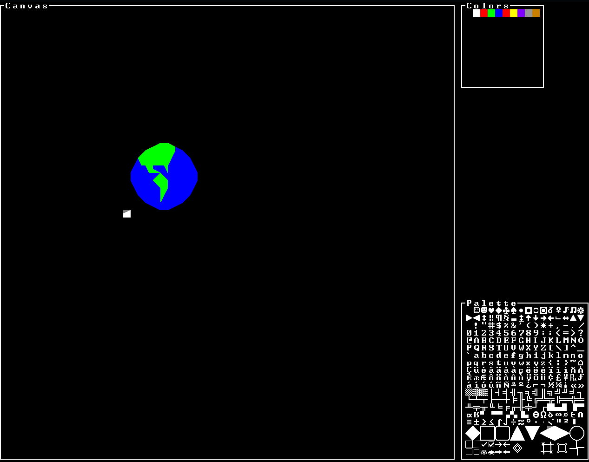
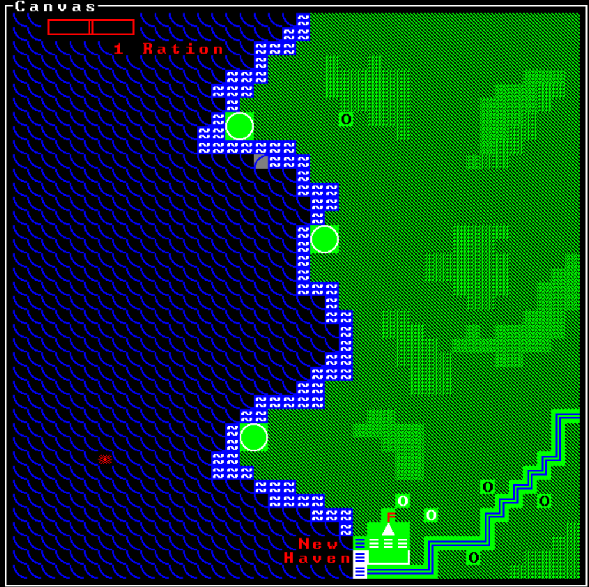

# Daile

Daile (the Lithuanian word for painter) is a glyph/tile based paiting program. Daile was written in Rust using the Rust bindings for the `tcod` as part of learning the language, mainly as a way to gain practice with using Rust to write a non-trivial program.

## Installation

The most recent version of the [rust bindings for the tcod](https://github.com/tomassedovic/tcod-rs) library doesn't compile correctly on modern Rust versions (as of `1.36.0`, when `mem::uninitialized` was replaced with `mem::MaybeUninit`). [A fix](https://github.com/tomassedovic/tcod-rs/pull/315) has been acceptted, but an update to the library with the fix has not been released yet, so you'll have to fix it yourself. You can do that by first fetching the most recent version of the library by building:

```cargo build```

Then navigating to `$HOME//home/aaron/.cargo/registry/src/github.com-[numbers]/tcod-0.15.0/src/` and making the changes shown [in this diff](https://github.com/tomassedovic/tcod-rs/pull/315/commits/8c40340599b0d60051fee2ad956152e478a87738) to `input.rs`. Then, to force cargo to rebuild `tcod-rs` clean the build artifacts and build again:

```cargo clean && cargo build```

## Usage

Left click on the canvas to set the highlighted tile to the currenly selected glyph (shown in the palette). Right click to erase a tile on the canvas. Select a glyph from the palette either by clicking on it, or using the scroll wheel to select one. Foreground and background colors for each glyph can be selected by left and right clicking (respectively) a color from the colors section.

## Gallery

A very poorly drawn globe, showing the general UI.


An ASCII art map of a fantasy setting from a tabletop RPG I play with my friends, made by the GM of that game.

